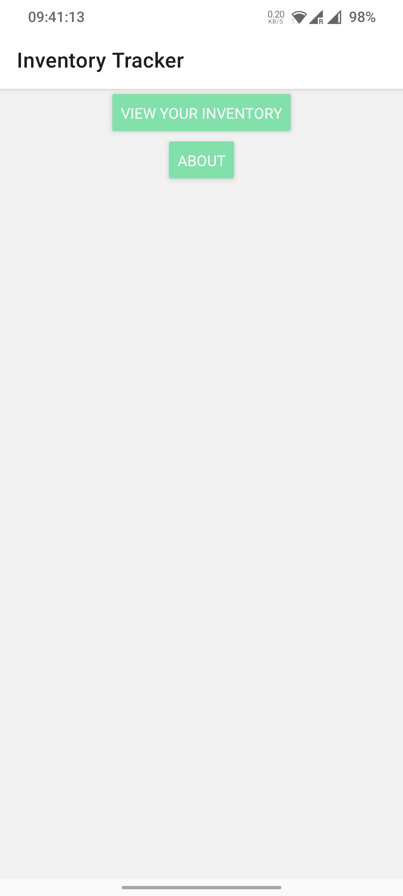
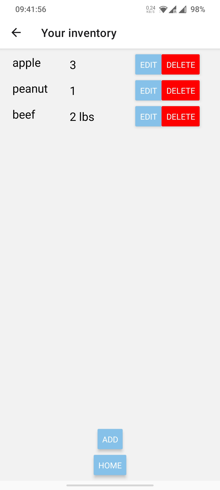
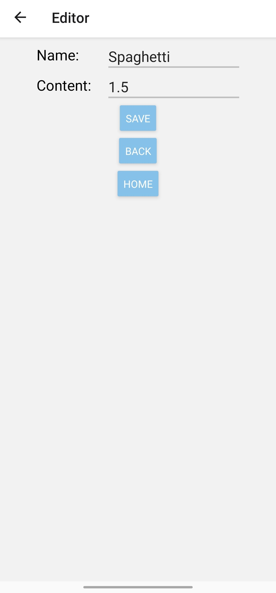

# Inventory Tracker

This app is an inventory tracker, which tracks all your food, medicine and any other things you have. Never forget any tiny object in your house any more. 

## Screen shots

- Left: Home screen
- Middle: Inventory viewer
- Right: Editor (by click "add" or "edit" button)

## Developer note

This app is a react native based app, consisting a home screen, a viewer and an editor. Users are supposed to navigate between them by several buttons, as well as os-provided navigation. Navigation is implemented with `react-navigation`. Data are stored with `react-native-async-storage`. The editor writes objects to local storage, which is then read by viewer. For each object, the view create a `flat list` to show its content and two buttons for edit and delete operations. 