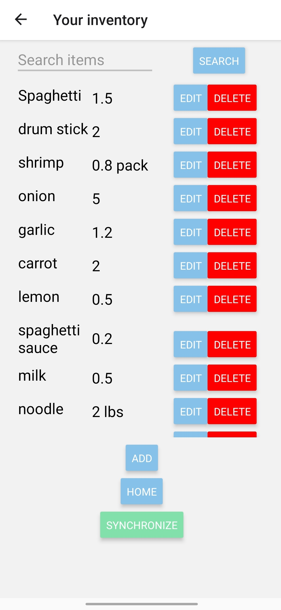
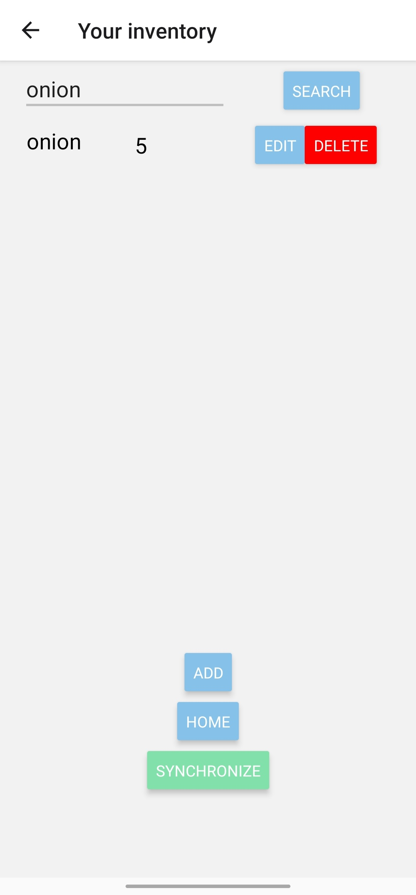

# Inventory Tracker

This app is an inventory tracker, which tracks all your food, medicine and any other things you have. Never forget any tiny object in your house any more. The app provides search and synchronization functions.

## Synchronization

Users may register a new uid on the sync screen. The server then returns a randomely generated uid to user. Copying this uid to other devices and login enables users to have the same content on multiple devices.

## Screen shots

- Upper left: Viewer screen
- Upper right: Search specific items
- Lower left: Editor (by click "add" or "edit" button)
- Lower right: Synchronize screen

## Developer note

This app is a react native based app, consisting a home screen, a viewer and an editor. Users are supposed to navigate between them by several buttons, as well as os-provided navigation. Navigation is implemented with `react-navigation`. Data are stored with `react-native-async-storage`. The editor writes objects to local storage, which is then read by viewer. For each object, the view create a `flat list` to show its content and two buttons for edit and delete operations. 